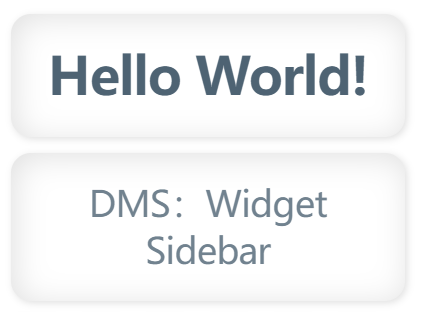
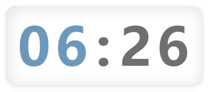
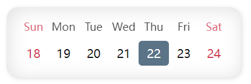
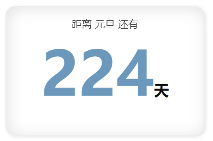
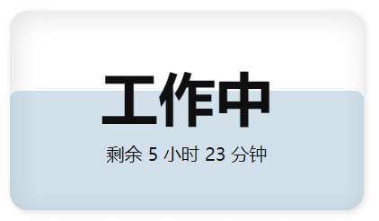
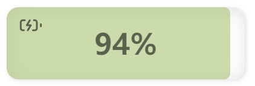
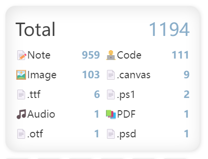

# DMS: Widget Sidebar

<div align="middle">
  
  <a href="README_zh.md">
    
  </a>
</div>

A sidebar widget system for Obsidian.

## Installation

- Download the latest version from the Releases page and extract it to the `Vault/.obsidian/plugins/dms-widget-sidebar` folder.
- Enable the plugin in Obsidian.

## Usage

- You can create multiple sidebars in the plugin settings
- You can add multiple widgets to each sidebar in the plugin settings
- Activate the [Default] widget sidebar from the left Ribbon
- Type `Widget Sidebar` in the command palette to list commands for activating all sidebars. These commands can be used to open your newly created sidebars.
- Sidebars can be dragged to various positions for better layout customization.
- However, it's recommended to keep the default sidebar on the right side for better mobile usage.

## Widgets

### Title



There are two types: large title and small title. They will be rendered as h1 and h3 headings respectively.

The widget code will be used as the title content.

### Digital Clock



Displays the current time in `HH:mm` format. This widget does not require any code setting.

### Time Progress


Displays the progress of the year, month, week, and day. This widget does not require any code setting.

### Week Calendar



Displays the calendar for the current week. This widget does not require any code setting.

### Month Calendar


Displays the calendar for the current month. This widget does not require any code setting.

### Year Points


Displays the grid points for the current year progress. This widget does not require any code setting.

### Countdown Day



Displays the number of days between today and a specific date, whether it's a past or future date. Two parameters need to be set: the name of the date and the specific time.

The code format is as follows:

```text
name: Labor Day
date: 2023-05-01
```

### Working Time Progress



Displays the remaining working time for today. The default working time are from 9:00 to 18:00. Configuration method is as follows:

```text
startTime: 9:00
endTime: 18:00
```

If the end time is earlier than the start time, it will be considered as working until the corresponding time on the 2nd day.

If the end time starts with a plus sign, such as `endTime: +18:00`, it will be considered as working until 18:00 on the 2nd day.

### Quick Navigation


Used to create navigation items, or more appropriately called quick action buttons. The most basic function is to open notes or links. However, when combined with [Obsidian URI](https://help.obsidian.md/Extending+Obsidian/Obsidian+URI) functionality or plugins like [Advanced URI](https://github.com/Vinzent03/obsidian-advanced-uri), it can do many things. For example, you can pin commands to the sidebar for one-click activation. If you use it with QuickAdd's Capture feature, you can quickly record ideas. Feel free to be creative here.

The Code format is as follows:

```text
Link description, shown on hover | Link icon | Link address
```

For example:

```text
Open note | 📝 | obsidian://open?vault=Vault&file=note
```

For icons, you can use:

- An image URL (starts with http or ends with a file extension, which is considered an image URL).
- An Emoji.
- An Obsidian icon (name, such as: `search`). Refer to icon names in [Lucide](https://lucide.dev/icons/search).

### Text

The widget code will be rendered as Markdown.

### Image


The widget code will be used as the image path. You can use both online images and local images. For local images, the path should be relative to the repository root.

### Random Notes


Displays 5 random notes. The widget code serves as an exclusion list, configured in the same way as above.

### Battery Status



Displays the current device's battery level and charging status. It shows different colors based on the battery level and indicates the charging status. This widget does not require any code setting. While this widget may not be particularly useful on mobile devices, I find it quite helpful when using a laptop. Since the status information is updated every minute, the charging status won't change immediately when plugging or unplugging the charger. Most of the time, we don't need such instantaneous information, so it's good to understand this imperfect detail.

### File Statistics



Simply displays the number of various files in the repository. The widget code serves as an exclusion list, with one rule per line. If a file path matches any of these rules (matching starts from the beginning of the path), it will be excluded. For example:

```text
FolderName/
```

This will exclude all files that start with `FolderName/`.

### Daily Event Tracker


Used to record and display daily event completion times, including a dot matrix chart showing historical records and a list of today's records. The dot matrix chart displays records from the last 36 days (hiding earlier records if they don't fit), with each dot representing a record time. The today's record list shows all specific times recorded for the day and provides editing and deletion functions.

This widget can be used to record things like medication times or exercise frequency, etc.

The code format is as follows:

```text
title: Daily Event Tracker
note: Record file path
```

Where `title` is the widget title; `note` is the path to the note file where records are saved, this item must be set for the widget to function properly.

The record format is `MM-DD / HH:mm | HH:mm`, with one date per line, followed by all record times for that day, with times separated by `|`. Manual modification of the data file is not recommended. If you need to modify it manually, please restart Obsidian after modification to ensure the plugin loads the data correctly. If needed, you can add brief additional information after the time, but be careful not to use the separators mentioned above to avoid parsing issues.

## Custom Types

Custom type widgets are rendered as code blocks, with your specified type as the code block language. This can be used to add various specially rendered code blocks, such as `dataviewjs`.

This means you can use many third-party plugins to create your own widgets.

Please note that since these widgets are in the sidebar view rather than within notes, third-party plugins cannot access data like the current note.

## Buy Me a Coffee

If you find this plugin helpful, you can buy me a coffee. —— [Support Me on Afdian](https://afdian.com/a/daomishu)