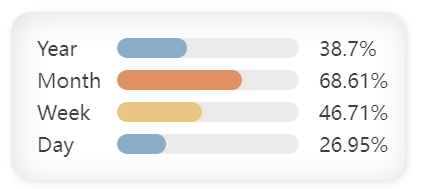
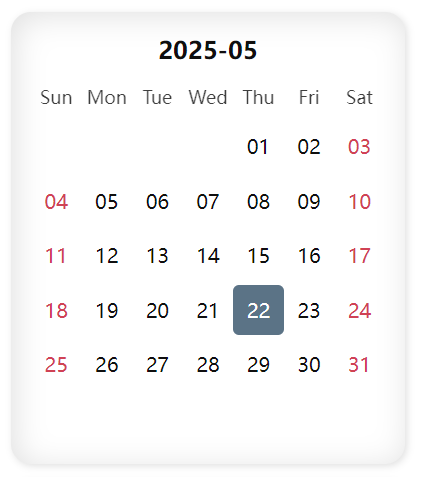
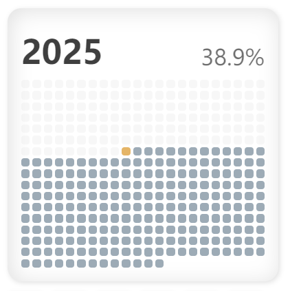
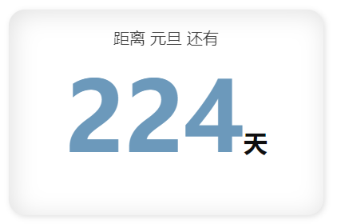
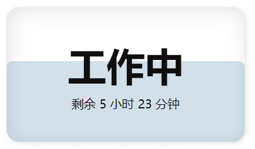
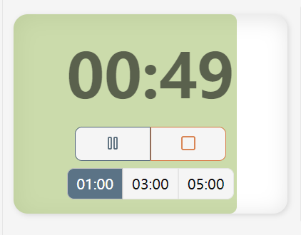
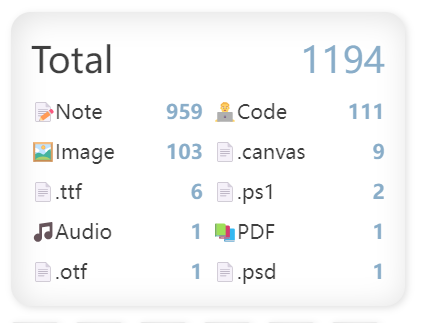
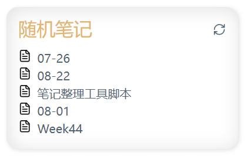
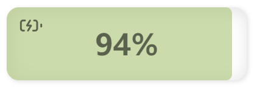
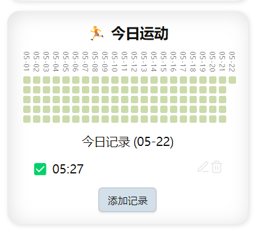

# DMS: 挂件侧边栏

<div align="middle">
  <a href="README.md">
    
  </a>
  
</div>

一个 Obsidion 的侧边栏挂件系统。

## 安装

### BRAT

- 首先在 Obsidian 中安装并启用 BRAT 插件。
- 然后在 BRAT 插件设置中——Beta plugins list——Add beta plugin
- Github repository for beta plugin: `https://github.com/dmscode/DMS-Widgets-Sidebar`
- Select a version: `Latest version`
- 勾选 Enable after installing the plugin，然后点击 Add plugin 完成安装。
- 此方法可以实现插件的自动更新。

### 自行下载

- 从 Releases 页面下载最新版本，解压到 `Vault/.obsidian/plugins/dms-widget-sidebar` 文件夹中。
- 在 Obsidian 中启用插件。

## 使用

- 在插件设置中可以创建多个侧边栏
- 在插件设置中可以为侧边栏添加多个小挂件
- 左侧 Ribbon 中可以激活【默认】挂件侧边栏
- 在命令面板中输入 `Widget Sidebar` 可以列出激活所有侧边栏的命令。通过这些命令，可以打开你新创建的侧边栏。
- 侧边栏可以拖拽到各种位置，以便更好地进行布局美化。
- 但是推荐将默认侧边栏放在右侧，这样方便在移动端使用。

## 挂件

### 标题


分为两种：大标题和小标题。会分别渲染为1号标题和3号标题。

挂件代码会被作为标题内容。

### 数字时钟


显示当前时间，格式为`HH:mm`。此挂件无需设置代码。

### 时光进度



显示年、月、周、日的进度。此挂件无需设置代码。

### 周历


显示当前周的日历。此挂件无需设置代码。

### 月历



显示当前月的日历。此挂件无需设置代码。

### 年度点阵



显示当前年的点阵进度。此挂件无需设置代码。

### 倒数日



可以显示某一天距离今天的天数，无论是已经过去的日期还是未来的日期。需要设置两个参数日期的名称和具体的时间。

code 部分的格式如下：

```text
name: 劳动节
date: 2023-05-01
```

### 工作时间进度



显示今天剩余的工作时间。默认工作时间为 9:00 到 18:00。设置方法如下:

```text
startTime: 9:00
endTime: 18:00
```

如果结束时间早于起始时间，则视为工作至第 2 天的对应时间。

如果结束时间以加号开头，如 `endTime: +18:00`，则视为工作至第 2 天的 18:00。

### 倒计时器



用来进行简单的倒计时。可以预设几组时间，code 部分的格式如下：

```text
12
03:02
01:05:12
```

分别表示12秒、3分钟2秒、1小时5分12秒。一般设置3~4组比较合适。如未进行设置则默认为 1 分钟 3 分钟和 5 分钟。

计时结束会有简单的蜂鸣提示。

**此计时器并非十分准确，会受各种因素影响。请不要用于需要精确计时的场景。**

### 快速导航


用来创建一些导航项，或者叫做快速操作按钮可能更为合适。最基础的功能就是用来打开笔记或者链接。但如果搭配 [Obsidian 的 URI](https://help.obsidian.md/Extending+Obsidian/Obsidian+URI) 功能或者[Advanced URI](https://github.com/Vinzent03/obsidian-advanced-uri) 之类的插件，可以做到非常多的事情。比如将一些命令固定在侧边栏，实现一键唤起。如果是换取 QuickAdd 的捕获（Capture）功能，就可以实现快速记录灵感。此处可以自由发挥自己的创意。

Code 部分的格式如下：

```text
链接的描述，会在鼠标悬停的时候显示 | 链接的图标 | 链接的地址
```

比如：

```text
打开笔记 | 📝 | obsidian://open?vault=Vault&file=笔记
```

对于图标可以使用：

- 一个图片地址（http开头，或者末尾有后缀，既被视为图片地址）。
- 一个 Emoji 表情。
- 一个 Obsidian 的图标（名称，如：`search`）。参考 [Lucide](https://lucide.dev/icons/search) 中的图标名称。

### 文件统计



简单显示仓库中各种文件的数量。挂件代码为排除列表，每行一条，如果文件路径与其中的规则匹配则被排除，匹配时从路径的开头开始匹配。比如：

```text
FolderName/
```

会排除所有以 `FolderName/` 开头的文件。

### 随机笔记



随机显示 5 条笔记。挂件代码为排除列表，设置方法同上。

### 电池状态



显示当前设备的电池电量和充电状态。会根据电量高低显示不同颜色，并在显示充电状态。此挂件无需设置代码。虽然在手机上，可能这个挂件没有什么用途，但在使用笔记本的时候我觉得它还是有一定作用的。因为状态信息是每分钟更新，所以插拔充电头时充电状态不会立刻改变，多数时候我们也并不需要十分即时的信息，了解一下这个不完美的细节就好。

### 每日事件记录



用于记录和显示每日事件完成时间，包含点阵图显示历史记录和今日记录列表。点阵图会显示最近 36 天的记录（如果显示不下则隐藏较早的记录），每个点代表一个记录时间。今日记录列表显示当天所有记录的具体时间，并提供编辑和删除功能。

此挂件可以用来记录比如吃药的时间，或者运动的次数等等。

code 部分的格式如下：

```text
title: 每日事件记录
note: 记录文件路径
```

其中 `title` 为挂件标题；`note` 为记录保存的笔记文件路径，必须设置此项才能正常使用挂件。

记录格式为 `MM-DD / HH:mm | HH:mm`，每行一个日期，日期后跟该日所有记录时间，时间之间用 `|` 分隔。不建议手动修改数据文件。如果需要手动修改，请在修改后重启 Obsidian，以便确保插件正确载入数据。如果有需要，可以在时间后面加入一些简短的额外信息，但需要注意不要使用上面的分隔符，以免影响解析。

### 文本

挂件的代码会被当作 Markdown 渲染。

### 图片


挂件的代码会被当作图片的路径。可以使用网络图片，也可以使用本地图片。如果是本地图片则图片路径相对于仓库的根目录。

## 自定义类型

自定义类型的挂件会作为代码块进行渲染，你所设定的类型作为代码块的语言。这可以用来添加各种可以被特殊渲染的代码块，比如：`dataviewjs`。

这意味着你可以利用许多第三方插件来创建自己的挂件。

需要注意的是，因为这些挂件处于侧边栏视图而不是笔记之中，所以第三方插件并不能获得比如当前笔记之类的数据。

## 请我喝杯咖啡吧

如果你觉得这个插件对你有帮助，你可以请我喝杯咖啡。—— [老鼠爱发电](https://afdian.com/a/daomishu)